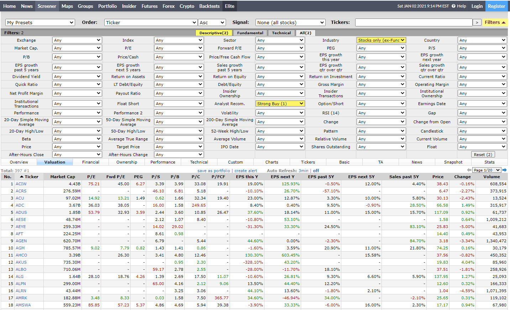

# pyfinviz
A python package that scrapes data from finviz.com and utilizes the pandas module.
This package uses a fixed set of parameter options so you don't have to memorize them. 

### Install
```
pip install pyfinviz
```

## Usage
### News
Information from https://finviz.com/news.ashx.
```python
from pyfinviz.news import News

news = News()

# available variables:
print(news.main_url)  # scraped URL
print(news.soup)  # beautiful soup object
print(news.news_df)  # NEWS table information in a pd.DataFrame object
print(news.blogs_df)  # BLOGS table information in a pd.DataFrame object
```

### Cryto
Information from https://finviz.com/crypto_performance.ashx. 
Uses relative performance options (D, W, M, MTD, Q, HY, Y, YTD)
```python
from pyfinviz.crypto import Crypto

# with no params (SECTOR, OVERVIEW by default)
crypto = Crypto()
# with params
crypto = Crypto(relative_performance_option=Crypto.RelativePerformanceOption.ONE_YEAR)

# available variables:
print(crypto.main_url)  # scraped URL
print(crypto.soup)  # beautiful soup object
print(crypto.table_df)  # table information in a pd.DataFrame object
```

### Groups
Information from https://finviz.com/groups.ashx. Uses group options 
(Sector, Industry..., Capitalization) and view options (Overview, Valuation, Performance, Custom)
```python
from pyfinviz.groups import Groups

# with no params (sector overview)
groups = Groups()
# with params (View the group VALUATION of the INDUSTRY sector)
groups = Groups(group_option=Groups.GroupOption.INDUSTRY, view_option=Groups.ViewOption.VALUATION)
# with params (View the group PERFORMANCE of the TECH sector)
groups = Groups(group_option=Groups.GroupOption.INDUSTRY_TECHNOLOGY,
                view_option=Groups.ViewOption.PERFORMANCE)

# available variables:
print(groups.main_url)  # scraped URL
print(groups.soup)  # beautiful soup object
print(groups.table_df)  # table information in a pd.DataFrame object
```

### Insider
Information from https://finviz.com/insidertrading.ashx. Uses filter options 
(BUY, SELL, ALL) and view options (LATEST, TOP_INSIDER_TRADING_RECENT_WEEK, ...)
```python
from pyfinviz.insider import Insider

# with no params (ALL the LATEST insider trades)
insider = Insider()
# with params (the LATEST BUY insider trades)
insider = Insider(filter_option=Insider.FilterOption.BUY)

# available variables:
print(insider.main_url)  # scraped URL
print(insider.soup)  # beautiful soup object
print(insider.table_df)  # table information in a pd.DataFrame object
```

### Quote
Information from https://finviz.com/quote.ashx. The Quote class grabs all the information, 
creates an object and returns it. Variable names that end in _df are pd.DataFrame objects.
```python
from pyfinviz.quote import Quote

quote = Quote(ticker="AMZN")

# available variables:
print(quote.exists)  # check if fetch was successful (STOCK may not exist)
print(quote.ticker)  # AMZN
print(quote.exchange)  # NASD
print(quote.company_name)  # Amazon.com, Inc.
print(quote.sectors)  # ['Consumer Cyclical', 'Internet Retail', 'USA']
print(quote.fundamental_df)  # Index    P/E EPS (ttm) Insider Own  ...  SMA50  SMA200     Volume  Change
print(quote.outer_ratings_df)  # 0   Nov-04-20     Upgrade  ...                Hold → Buy  $3360 → $4000
print(quote.outer_news_df)  # 0   Jan-04-21 10:20PM  ...                   Bloomberg
print(quote.income_statement_df)  # 1      12/31/2019  ...                    22.99206
print(quote.insider_trading_df)  # 0         WILKE JEFFREY A  ...  http://www.sec.gov/Archives/edgar/data/1018724...
```

### Screener
Information from https://finviz.com/screener.ashx?ft=4. The Screener class uses 
ALL the options (dropdowns) in the webpage mentioned in the last sentence (over 60), and uses
view options (OVERVIEW, VALUATION, ..., CUSTOM). You can also specify a range of pages to fetch.
```python
from pyfinviz.screener import Screener

# with no params (default screener table)
screener = Screener()
# with params (The first 3 pages of "STOCKS ONLY" where Analyst recommend a strong buy)
options = [Screener.IndustryOption.STOCKS_ONLY_EX_FUNDS, Screener.AnalystRecomOption.STRONG_BUY_1]
screener = Screener(filter_options=options, view_option=Screener.ViewOption.VALUATION,
                    pages=[x for x in range(1, 4)])

# available variables:
print(screener.main_url)  # scraped URL
print(screener.soups)  # beautiful soup object per page {1: soup, 2: soup, ...}
print(screener.data_frames)  # table information in a pd.DataFrame object per page {1: table_df, 2, table_df, ...}
```
Webpage from previous fetch:


pandas output:
```
    No Ticker MarketCap     PE  ... Salespast5Y   Price  Change     Volume
0    1   ACIW     4.43B  75.21  ...       4.40%   38.43  -0.16%    608,554
1    2   ACRS   276.59M      -  ...           -    6.47  -2.27%    373,915
2    3    ACU    97.02M  14.92  ...       5.80%   30.13  -2.43%     13,524
3    4    ADC     3.67B  36.03  ...      28.50%   66.58   1.49%    315,917
4    5   ADUS     1.85B  53.79  ...      15.70%  117.09   0.92%     61,737
5    6   AESE    48.74M      -  ...           -    1.58   0.64%  1,009,212
6    7   AEYE   259.33M      -  ...      83.10%   25.83  -5.00%     41,683
7    8    AFT   224.25M      -  ...           -   14.40   0.49%     43,953
8    9   AGEN   620.70M      -  ...      84.70%    3.18  -3.34%  1,340,472
9   10    AGM   785.57M   9.02  ...      21.80%   74.25   0.16%     30,179
10  11   AHCO     3.39B      -  ...           -   37.56  -0.82%    450,352
11  12   AKUS   735.30M      -  ...           -   19.83   4.04%     85,960
12  13   ALBO   710.06M      -  ...           -   37.51  -1.81%    258,926
13  14    ALG     1.64B  28.10  ...       5.90%  137.95   1.27%     25,093
14  15   ALPN   299.00M      -  ...           -   12.60   0.32%    166,333
15  16   ALRN    43.44M      -  ...           -    1.04  -4.59%  1,071,395
16  17   AMRK   182.88M   3.48  ...      -2.10%   25.65   0.31%    119,102
17  18  AMSWA   559.23M  85.85  ...       2.30%   17.17   0.94%     67,980
18  19   AMTI     1.07B      -  ...           -   30.77  -8.31%     70,411
19  20   ANIK   656.72M      -  ...       1.70%   45.26   1.05%     79,476
0   21    APT   155.99M   7.69  ...      -0.40%   11.15  -1.24%  1,148,691
1   22   AQMS   172.56M      -  ...           -    3.00  -1.64%  2,168,579
2   23   ARAY   378.01M  27.80  ...       0.20%    4.17  -0.48%    621,424
3   24   ARDC   327.45M      -  ...           -   14.29   0.07%     70,648
4   25   ARDX   588.96M      -  ...     -30.10%    6.47  -3.86%    323,062
5   26   ASND     9.02B      -  ...      -0.90%  166.78  -2.00%     74,233
6   27    ASX    12.11B  14.67  ...           -    5.84  -0.85%    439,892
7   28   ATEN   776.87M  78.88  ...       3.40%    9.86   0.41%    357,503
8   29   ATHA     1.21B      -  ...           -   34.25   4.90%    129,947
9   30   ATNI   657.72M      -  ...       5.50%   41.76  -0.33%     25,380
10  31   ATRC     2.50B      -  ...      16.50%   55.67   1.51%    244,269
11  32   ATRS   663.26M  70.00  ...      36.10%    3.99  -0.99%    812,128
12  33   AUVI    36.63M      -  ...           -    4.59  -6.52%    181,841
13  34   AVDL   395.06M      -  ...      31.60%    6.68  -0.15%    692,233
14  35   AVEO   169.35M      -  ...       9.70%    5.77   0.87%    218,677
15  36    AVO     1.03B  29.74  ...           -   15.05   0.07%    129,926
16  37    AWH   687.64M      -  ...      12.50%    6.71   5.84%    601,774
17  38   AYTU   104.65M      -  ...     153.90%    5.98  -0.99%    611,093
18  39   BASI   141.08M      -  ...      21.60%   12.30  10.91%    184,761
19  40   BBGI    43.09M      -  ...      34.80%    1.49  -3.87%    192,009
0   41    BBI    38.58M      -  ...     -12.30%    0.78  -3.21%  1,150,725
1   42    BBL   150.24B  16.89  ...      -0.80%   53.03  -0.77%    673,974
2   43   BBSI   531.36M  13.73  ...       8.20%   68.21   3.33%     53,629
3   44   BCOR   740.93M      -  ...      47.20%   15.91  -0.81%    501,047
4   45    BCS    34.69B  12.99  ...       1.70%    7.99  -0.50%  2,017,726
5   46   BDSX   583.83M      -  ...           -   20.16   6.84%     97,245
6   47   BEAM     4.88B      -  ...           -   81.64  -1.07%    936,147
7   48    BIO    17.42B   4.99  ...       1.20%  582.94   1.41%    139,476
8   49   BIOX   229.59M  69.66  ...           -    6.20   8.87%     95,378
9   50   BLCT   366.63M      -  ...           -   10.10  -0.79%    131,826
10  51    BLX   625.60M   8.62  ...       5.20%   15.83   1.41%     91,844
11  52    BTG     5.88B   9.15  ...           -    5.60  -2.10%  5,698,582
12  53   BWAY    83.88M      -  ...           -    7.54  10.23%     86,655
13  54   BWMX     1.18B      -  ...           -   34.15  -2.15%     21,649
14  55   BYSI   491.78M      -  ...           -   12.20  -7.99%    389,083
15  56   CALA   359.41M      -  ...           -    4.91  -3.91%  1,257,056
16  57   CALT   839.52M      -  ...           -   33.62  -1.03%        999
17  58   CASI   378.07M      -  ...     180.60%    2.95  -0.34%    347,045
18  59   CBAY   399.04M      -  ...           -    5.74  -2.38%  4,248,910
19  60    CBZ     1.44B  19.13  ...       5.70%   26.61  -0.11%    212,684

[60 rows x 18 columns]
```
